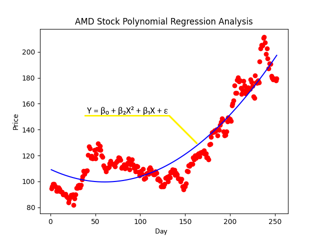
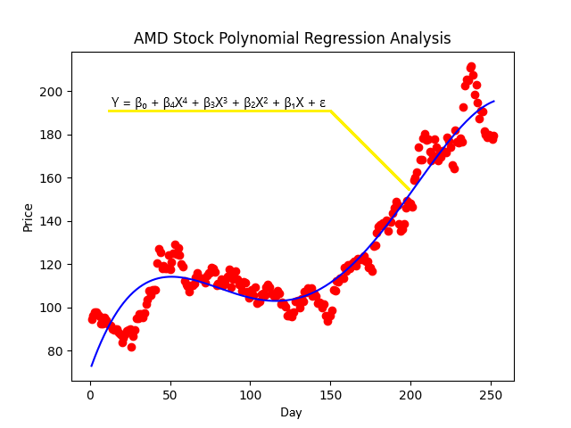
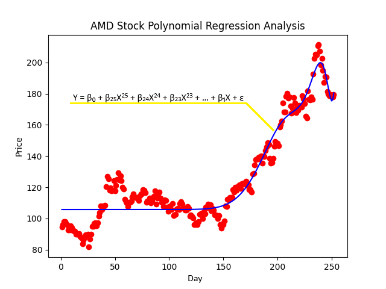

# What is Polynomial Regression?
Today we're venturing into the realm of polynomial regression, a technique that tackles the challenge of modelling non-linear relationships between variables. Let's use an example to understand this concept better. Imagine we're trying to predict the closing stock price of a company based on the day of the year. A simple linear regression model might not suffice if the stock price follows a curved pattern over time. That's where polynomial regression comes in!

## Core Concepts
- **Linear vs. Non-linear Relationships:** Linear regression assumes a straight-line relationship between the independent and dependent variables. Polynomial regression relaxes this assumption, allowing for more complex, curved relationships.
- **Polynomial Terms:** We achieve this flexibility by introducing polynomial terms of the independent variable(s). These terms are created by raising the variable(s) to different powers (e.g., x, x², x³).
- **Higher-Order Polynomials:** As the degree of the polynomial increases, the model can capture more complex curves. However, with great power comes great responsibility (to avoid overfitting!).

## Mathematical Representation
Here's the formula for a second-degree polynomial regression model with one independent variable (Day):

#### `Y = β₀ + β₂X² + β₁X + ... + ε`

- `Y` = Predicted value of the dependent variable (Close)
- `β₀` = Intercept
- `β₁` = Coefficient for the linear term (X)
- `β₂` = Coefficient for the squared term (X²)
- `ε` = Error term

## Visualizing the Curve
Let's plot the Day on the x-axis and the Closing Price on the y-axis. A second-degree polynomial regression would result in a U-shaped or an inverted U-shaped curve, depending on the coefficients.

- Following plot shows **Polynomial Regression model with degree 2.**

- Higher-degree polynomials can create even more intricate curves. Following plot shows **Polynomial Regression model with degree 4.**

Higher the degree of the polynomial regression equation, closer the model line gets to the data points.

Although **be careful**, using a degree too high might overfit the data jeopardizing the accuracy and effectiveness of the model.
- For example, below given graph shows the same model but with a **degree of 25.**

## Important Considerations
- Overfitting: Higher-degree polynomials can easily overfit the data, meaning the model captures random noise instead of the underlying trend. Techniques like cross-validation help us choose the appropriate polynomial degree.
- Model interpretability: As the polynomial degree increases, the model becomes more complex and interpreting the coefficients can become challenging.

## In Conclusion
Polynomial regression is a powerful tool for modeling non-linear relationships. By carefully choosing the polynomial degree and considering overfitting, you can create models that capture the nuances of your data and improve your predictions.

## Ready to Explore Further?
This is just a glimpse into polynomial regression. As you delve deeper, you'll explore:
- Feature Scaling: Ensuring all features are on a similar scale to avoid certain terms dominating the model.
- Regularization Techniques: Methods like L1 and L2 regularization can help prevent overfitting by penalizing overly complex models.
- Basis Functions: Alternative representations of features that can be used in polynomial regression and other machine learning models.

**The key is to find the right balance between model complexity and generalizability!**

If you want to dig deeper and learn more about polynomial regression, go through the resources given at the end and learn more in-depth concepts.

Remember, practice makes one perfect, so grab your data and start exploring!

## Additional Resources

- [Coursera - Polynomial Regression](https://www.coursera.org/learn/machine-learning-data-analysis)
  - This Coursera course covers polynomial regression along with other machine learning and data analysis techniques.
- [Khan Academy - Polynomial Regression](https://www.khanacademy.org/math/statistics-probability/describing-relationships-quantitative-data/quadratic-regression/v/polynomial-regression)
  - Khan Academy offers a comprehensive tutorial on polynomial regression, explaining the concepts step by step.
- [YouTube - Polynomial Regression Analysis in Python](https://www.youtube.com/watch?v=QptS1BP1V4Q)
  - This YouTube tutorial demonstrates how to perform polynomial regression analysis using Python, including implementation and interpretation.
- [Statistics Solutions - Polynomial Regression Analysis](https://www.statisticssolutions.com/polynomial-regression-analysis/)
  - This resource provides a detailed explanation of polynomial regression analysis, including assumptions, interpretation of results, and practical examples.
- [Towards Data Science - Understanding Polynomial Regression](https://towardsdatascience.com/polynomial-regression-bbe8b9d97491)
  - This article on Towards Data Science delves into the intuition behind polynomial regression and explores various aspects of the technique.
- [Penn State University - Polynomial Regression with Nonlinear Data](https://online.stat.psu.edu/stat501/lesson/9)
  - This resource from Penn State University offers a comprehensive guide to polynomial regression, covering topics such as model building and interpretation with nonlinear data.
- [DataCamp - Polynomial Regression in R](https://www.datacamp.com/community/tutorials/polynomial-regression-R)
  - DataCamp offers a tutorial specifically focused on polynomial regression in R, providing hands-on experience with code examples and datasets.
- [MIT OpenCourseWare - Introduction to Computational Thinking and Data Science](https://ocw.mit.edu/courses/electrical-engineering-and-computer-science/6-0002-introduction-to-computational-thinking-and-data-science-fall-2016/)
  - This MIT course covers polynomial regression as part of its curriculum on computational thinking and data science.
- [UC Business Analytics R Programming Guide - Polynomial Regression](https://uc-r.github.io/polynomial_regression)
  - This guide offers a detailed explanation of polynomial regression using R programming language, including code examples and interpretation of results.
- [ResearchGate - Polynomial Regression Analysis in Social Sciences](https://www.researchgate.net/publication/270579560_Polynomial_Regression_Analysis_in_Social_Sciences)
  - This paper provides insights into the application of polynomial regression analysis in social sciences, highlighting its importance and challenges.